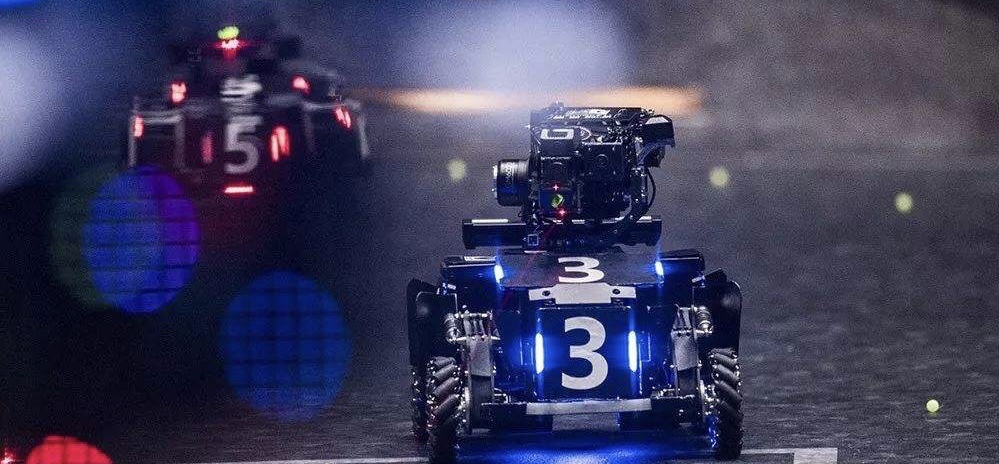
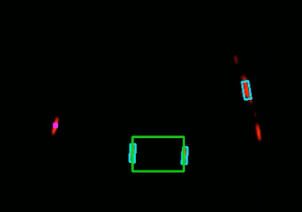
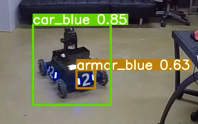

インターンシップ応募にあたり一時的に公開許可をもらい公開中  
主に装甲板認識部を担当(armor_detector,yolo)
チーム内wikiをもとに記述

# Overview

[RoboMaster](https://www.robomaster.jp/)での自動照準用の装甲版認識プログラム 
intel NUC,Ubuntu18.04,ROS,Dockerなどを用いて開発

#### 担当箇所
- armor_detector :装甲版認識1(opencv)
- yolo :装甲版認識2(Yolov5)
- img_proc :デバッグ用映像表示
- movie_publisher :デバッグ用映像入力
#### チームメイト作成
- serial_com :TypeAシリアル通信to機体制御マイコン
- industrial_camera_publisher :産業用カメラから映像取得

### ArmorDetector


主にopenCVを用いた幾何学的性質による認識  
カメラ映像よりRGBとモノクロ（輝度ベース）を取得しRGB画像では相手チームの色のみを，モノクロ画像では輝度が一定以上の領域を閾値処理で取得．
それらをAND処理することで相手チームの色で発光している領域を特定する．  
発光領域すべてを矩形で囲み，それらの角度，面積などのパラメータが装甲版らしい領域をフィルタリングする．  
白飛びしないように露光時間，絞りを調整すると発光部以外が真っ暗なため装甲版認識以外(番号認識等)でカメラが利用できない問題あり．
openCvにはHDRのライブラリもあるようなので要検討  
intel NUCで30FPS達成
参考: 深セン大学(https://github.com/yarkable/RP_Infantry_Plus)  
参考: OpenCV HDR(http://whitewell.sakura.ne.jp/OpenCV/py_tutorials/py_photo/py_hdr/py_hdr.html)  

### Yolo

CNN(Yolov5)による認識  
以下に示す公開されたデータセットを変換してYolov5で学習．
白飛び気味な映像でも認識してくれるが，かなり遅い(10FPS前後)ため要改善  
Yolov5: https://github.com/ultralytics/yolov5
データセット:https://terra-1-g.djicdn.com/b2a076471c6c4b72b574a977334d3e05/resources/DJI%20ROCO.zip
データセット変換:https://qiita.com/harmegiddo/items/d4387ae5aba8f9bcd354 （

## Requirements 
- Ubuntu18.04 or later
- ROS Noetic
- Python3.8 or later
- opencv4
- trollius rosdep rospkg rosinstall_generator rosinstall wstool vcstools catkin_pkg
- python3-catkin-tools
- その他Yolo関連パッケージ(yolo/script/requirements.txtに記載)

Dockerイメージから始めるのが楽(gitlab container registoryを利用: 全パッケージ導入済み)
```
docker login registry.gitlab.com
docker pull registry.gitlab.com/phoenix-robots/control/phoenix_vision_ros
```
もしくはDockerHubより入手し上記のパッケージを各自導入
```
docker pull osrf/ros:noetic-desktop-full
```
20210415現在apt installでE: Sub-process /usr/bin/dpkg returned an error code (1)が出る．対処法はREDME一番下のその他にて記載．

## Build & Run
Dockerイメージから起動する場合
```
sudo docker run -it --user=$(id -u):$(id -g) \
--env=DISPLAY=$DISPLAY \
--env=QT_X11_NO_MITSHM=1 \
--workdir="/home/$USER" \
--volume="/home/$USER:/home/$USER" \
--volume="/etc/group:/etc/group:ro" \
--volume="/etc/passwd:/etc/passwd:ro" \
--volume="/etc/shadow:/etc/shadow:ro" \
--volume="/etc/sudoers.d:/etc/sudoers.d:ro" \
--volume="/tmp/.X11-unix:/tmp/.X11-unix:rw" \
--network host \
--device /dev/ttyUSB0:/dev/ttyUSB0 \
--name {好きな名前。コンテナ名になる。既存とかぶってるとだめ} \
{docker image ID or 名前} bash
```
コンテナから起動する場合
```
docker start -i {コンテナID or 名前}
```
buildとrosの起動
```
cd ~/catkin_ws
catkin build
roscore
```
別ウインドウ(tmuxなどが楽)で
```
rosrun {起動したいパッケージ名}
```
例えば

# ToDo
- 軽量化: ros-topicの画像圧縮
- 軽量化: pytorchモデルをONNXに変換

# その他
### E: Sub-process /usr/bin/dpkg returned an error code (1)を治す．
パッケージに関する一時ファイルを削除して再インストール、アップデートする

'''Ubuntuでは/var/lib/dpkg/info配下に、パッケージのインストール前、インストール後に実行するためのスクリプトファイルや、その他パsudo chmod 666 /dev/ttyッケージに関する情報を含むファイルが置かれています。そしてこのディレクトリにある問題のパッケージ（ここではmysql-server-5.7）のpreinstとprerm（インストール前用スクリプトファイル）、postinstとpostrm（インストール後用スクリプトファイル）の削除します。'''

今回はsystemd-timesyncdでエラーになっているぽいので以下を実行したら治った:)
```
cd /var/lib/dpkg/info
sudo mv systemd-timesyncd.post* /tmp
sudo mv systemd-timesyncd.pre* /tmp
```

参考[https://www.virment.com/fix-sub-process-returned-an-error-code/]
